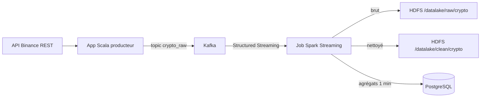

## TP Big Data – Pipeline temps réel crypto

Ce dépôt implémente un pipeline de données temps réel pour des cours de crypto-monnaies, depuis une API publique jusqu’à PostgreSQL, en passant par Kafka, Spark Structured Streaming et un Data Lake HDFS.

## Sujet

- Collecter en continu les prix d’une paire crypto (par défaut `BTCUSDT`) depuis l’API publique de Binance.
- Ingestion des ticks en temps réel dans Kafka sur le topic `crypto_raw`.
- Traitement distribué avec Spark Structured Streaming pour nettoyer, structurer et agréger les données.
- Stockage des données brutes et nettoyées dans un Data Lake HDFS.
- Chargement des données préparées et agrégées dans PostgreSQL pour l’analyse.

## Architecture

Flux de bout en bout.



Principaux composants.

- `producer` : application Scala qui interroge l’API Binance et envoie les ticks JSON vers Kafka.
- `spark-jobs` : job Spark Structured Streaming qui lit Kafka, nettoie les données, écrit en Parquet sur HDFS et pousse des agrégats dans PostgreSQL.
- `scripts` : scripts d’initialisation et d’orchestration (`init_kafka_topics.sh`, `init_postgres.sql`, `run_spark_jobs.sh`, `queries_examples.sql`).
- `docker-compose.yml` : définition des services d’infrastructure (Kafka, HDFS, Spark, PostgreSQL).

## Lancement de l’infrastructure

Prérequis installés sur la machine.

- Docker
- Docker Compose
- Java et SBT pour builder et lancer les projets Scala

Étapes.

1. Se placer dans le répertoire racine du TP.
2. Démarrer l’infrastructure.

```bash
docker compose up -d
```

3. Créer le topic Kafka `crypto_raw`.

```bash
bash scripts/init_kafka_topics.sh
```

4. Vérifier que PostgreSQL est initialisé avec le schéma `crypto` et les tables.

```bash
docker compose exec postgres psql -U crypto -d crypto -c "\dt crypto.*"
```

## Build et exécution du producteur Scala

Le producteur se trouve dans `producer`.

Variables d’environnement par défaut (toutes optionnelles).

- `CRYPTO_API_URL` : URL de base de l’API (par défaut `https://api.binance.com`).
- `CRYPTO_SYMBOL` : symbole de la paire, par exemple `BTCUSDT`.
- `CRYPTO_POLL_INTERVAL_MS` : intervalle de polling en millisecondes (par défaut `5000`).
- `KAFKA_BOOTSTRAP_SERVERS` : bootstrap Kafka (par défaut `kafka:9092`).
- `KAFKA_TOPIC` : topic de sortie (par défaut `crypto_raw`).
- `KAFKA_CLIENT_ID` : identifiant client Kafka.

Build et lancement.

```bash
cd producer
sbt run
```

L’application commence à interroger l’API et à envoyer des messages JSON sur Kafka.

## Build et exécution du job Spark Streaming

Le job Spark se trouve dans `spark-jobs`. Il doit être packagé avant de lancer `spark-submit`.

Depuis le répertoire `spark-jobs`.

```bash
cd spark-jobs
sbt package
cd ..
```

Le JAR est alors disponible dans `spark-jobs/target/scala-2.12/crypto-spark-jobs_2.12-0.1.0-SNAPSHOT.jar`, monté dans le conteneur `spark-master` sous `/opt/spark/jobs`.

Lancer le job Spark via le script d’orchestration.

```bash
bash scripts/run_spark_jobs.sh
```

Le job démarre un streaming continu qui.

- Lit le topic Kafka `crypto_raw`.
- Écrit les messages bruts dans HDFS sous `hdfs://namenode:8020/datalake/raw/crypto`.
- Nettoie et typise les données puis écrit en Parquet dans `hdfs://namenode:8020/datalake/clean/crypto`.
- Calcule des agrégats par minute et les enregistre dans la table `crypto.crypto_prices_agg_1min` dans PostgreSQL.

## Vérifications et analyse

Vérifier que des fichiers sont écrits dans HDFS depuis un conteneur Hadoop.

```bash
docker compose exec namenode hdfs dfs -ls /datalake/raw/crypto
docker compose exec namenode hdfs dfs -ls /datalake/clean/crypto
```

Consulter les données dans PostgreSQL.

```bash
docker compose exec postgres psql -U crypto -d crypto
```

Exemples de requêtes disponibles dans `scripts/queries_examples.sql`. Exemples.

```sql
SELECT
  symbol,
  date_trunc('minute', event_timestamp) AS minute_bucket,
  AVG(price) AS avg_price
FROM crypto.crypto_prices_clean
GROUP BY symbol, date_trunc('minute', event_timestamp)
ORDER BY minute_bucket DESC
LIMIT 100;
```

```sql
SELECT
  symbol,
  window_start,
  window_end,
  open_price,
  high_price,
  low_price,
  close_price,
  trade_count
FROM crypto.crypto_prices_agg_1min
ORDER BY window_start DESC
LIMIT 100;
```

## Arrêt des services

Pour arrêter l’infrastructure.

```bash
docker compose down
```

