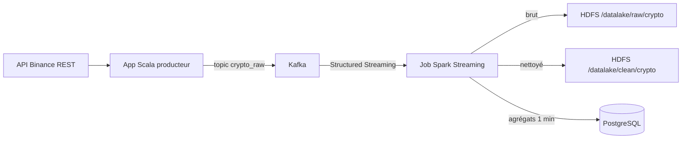

## TP Big Data – Pipeline temps réel crypto

Ce dépôt implémente un pipeline de données temps réel pour des cours de crypto-monnaies, depuis une API publique jusqu’à PostgreSQL, en passant par Kafka, Spark Structured Streaming et un Data Lake HDFS.

## Sujet

- Collecter en continu les prix d’une paire crypto (par défaut `BTCUSDT`) depuis l’API publique de Binance.
- Ingestion des ticks en temps réel dans Kafka sur le topic `crypto_raw`.
- Traitement distribué avec Spark Structured Streaming pour nettoyer, structurer et agréger les données.
- Stockage des données brutes et nettoyées dans un Data Lake HDFS.
- Chargement des données préparées et agrégées dans PostgreSQL pour l’analyse.

## Architecture

Flux de bout en bout.



Principaux composants.

- `producer` : application Scala qui interroge l’API Binance et envoie les ticks JSON vers Kafka.
- `spark-jobs` : job Spark Structured Streaming qui lit Kafka, nettoie les données, écrit en Parquet sur HDFS et pousse des agrégats dans PostgreSQL.
- `scripts` : scripts d’initialisation et d’orchestration (`init_kafka_topics.sh`, `init_postgres.sql`, `seed_postgres.sql`, `run_spark_jobs.sh`, `queries_examples.sql`).
- `docker-compose.yml` : définition des services d’infrastructure (Kafka, HDFS, Spark, PostgreSQL, Airflow, Grafana).

## Lancement de l’infrastructure

Prérequis installés sur la machine.

- Docker
- Docker Compose
- Java et SBT pour builder et lancer les projets Scala

Étapes.

1. Se placer dans le répertoire racine du TP puis démarrer l’infrastructure (Kafka, HDFS, Spark, PostgreSQL, Airflow, Grafana) :

```bash
docker compose up -d
```

Le service `postgres` applique automatiquement les scripts `scripts/init_postgres.sql` (création du schéma et des tables) et `scripts/seed_postgres.sql` (données d’exemple) dans la base `crypto` interne au docker-compose.

2. Créer le topic Kafka `crypto_raw`.

```bash
bash scripts/init_kafka_topics.sh
```

3. Vérifier que PostgreSQL est initialisé avec le schéma `crypto` et les tables (dans le conteneur `postgres`) :

```bash
docker compose exec postgres psql -U crypto -d crypto -c "\dt crypto.*"
```

## Build et exécution du producteur Scala

Le producteur se trouve dans `producer`.

Variables d’environnement par défaut (toutes optionnelles).

- `CRYPTO_API_URL` : URL de base de l’API (par défaut `https://api.binance.com`).
- `CRYPTO_SYMBOL` : symbole de la paire, par exemple `BTCUSDT`.
- `CRYPTO_POLL_INTERVAL_MS` : intervalle de polling en millisecondes (par défaut `5000`).
- `KAFKA_BOOTSTRAP_SERVERS` : bootstrap Kafka (par défaut `kafka:9092`).
- `KAFKA_TOPIC` : topic de sortie (par défaut `crypto_raw`).
- `KAFKA_CLIENT_ID` : identifiant client Kafka.

Build et lancement.

```bash
cd producer
sbt run
```

L’application commence à interroger l’API et à envoyer des messages JSON sur Kafka.

## Build et exécution du job Spark Streaming

Le job Spark se trouve dans `spark-jobs`. Il doit être packagé avant de lancer `spark-submit`.

Depuis le répertoire `spark-jobs`.

```bash
cd spark-jobs
sbt package
cd ..
```

Le JAR est alors disponible dans `spark-jobs/target/scala-2.12/crypto-spark-jobs_2.12-0.1.0-SNAPSHOT.jar`, monté dans le conteneur `spark-master` sous `/opt/spark/jobs`.

Lancer le job Spark via le script d’orchestration.

```bash
bash scripts/run_spark_jobs.sh
```

Le job démarre un streaming continu qui.

- Lit le topic Kafka `crypto_raw`.
- Écrit les messages bruts dans HDFS sous `hdfs://namenode:8020/datalake/raw/crypto`.
- Nettoie et typise les données puis écrit en Parquet dans `hdfs://namenode:8020/datalake/clean/crypto`.
- Calcule des agrégats par minute et les enregistre dans la table `crypto.crypto_prices_agg_1min` dans PostgreSQL.

## Vérifications et analyse

Vérifier que des fichiers sont écrits dans HDFS depuis un conteneur Hadoop.

```bash
docker compose exec namenode hdfs dfs -ls /datalake/raw/crypto
docker compose exec namenode hdfs dfs -ls /datalake/clean/crypto
```

Consulter les données dans PostgreSQL (service `postgres` du docker-compose) :

```bash
docker compose exec postgres psql -U crypto -d crypto
```

Exemples de requêtes disponibles dans `scripts/queries_examples.sql`. Exemples.

```sql
SELECT
  symbol,
  date_trunc('minute', event_timestamp) AS minute_bucket,
  AVG(price) AS avg_price
FROM crypto.crypto_prices_clean
GROUP BY symbol, date_trunc('minute', event_timestamp)
ORDER BY minute_bucket DESC
LIMIT 100;
```

```sql
SELECT
  symbol,
  window_start,
  window_end,
  open_price,
  high_price,
  low_price,
  close_price,
  trade_count
FROM crypto.crypto_prices_agg_1min
ORDER BY window_start DESC
LIMIT 100;
```

## Monitoring (Spark UI, Airflow et Grafana)

- UI Spark Master : `http://localhost:8082` (statut du cluster, workers, jobs en cours et terminés).
- Airflow Web UI : `http://localhost:8083` (orchestration des jobs, DAGs).
- Grafana : `http://localhost:3000` (login par défaut `admin` / `admin`).

Dans Grafana (qui tourne aussi dans le docker-compose), ajoute une source de données PostgreSQL pointant vers :

- **Host** : `postgres`
- **Port** : `5432`
- **Database** : `crypto`
- **User / Password** : `crypto` / `crypto`

Tu peux ensuite créer des tableaux de bord pour :

- Visualiser les séries temporelles de prix depuis `crypto.crypto_prices_clean`.
- Suivre les agrégats 1 minute depuis `crypto.crypto_prices_agg_1min`.

## Validation du workflow de bout en bout

Pour démontrer que la consigne est remplie de bout en bout :

1. **Collecte temps réel + Kafka**
   - Lancer le producteur depuis l’hôte :

   ```bash
   cd producer
   KAFKA_BOOTSTRAP_SERVERS=localhost:9092 sbt run
   ```

   - Vérifier dans Kafka (optionnel) que le topic `crypto_raw` reçoit des messages (via `kafka-console-consumer` ou les métriques Spark ci-dessous).

2. **Traitement distribué avec Spark + HDFS + PostgreSQL**
   - Builder le job Spark une fois :

   ```bash
   cd spark-jobs
   sbt package
   cd ..
   ```

   - Lancer le job de streaming :

   ```bash
   bash scripts/run_spark_jobs.sh
   ```

   - Dans l’UI Spark (`http://localhost:8082`), vérifier :
     - Une application `CryptoStreamingJob` en **RUNNING**.
     - Des lignes lues depuis Kafka et écrites par les requêtes de streaming.

   - Dans l’UI HDFS (`http://localhost:9870` → *Browse the filesystem*), vérifier :
     - Présence de fichiers sous `/datalake/raw/crypto` (brut).
     - Présence de fichiers sous `/datalake/clean/crypto` (nettoyé / structuré).

   - Dans PostgreSQL (via `docker compose exec postgres psql -U crypto -d crypto`), vérifier :
     - Que les tables `crypto.crypto_prices_clean` et `crypto.crypto_prices_agg_1min` contiennent des lignes.

3. **Visualisation / analyse avec Grafana**
   - Se connecter à Grafana (`http://localhost:3000`), créer une datasource PostgreSQL sur `postgres:5432`, base `crypto`, user `crypto`.
   - Créer un dashboard avec par exemple :
     - Une série temporelle sur `crypto.crypto_prices_clean` (timestamp vs price).
     - Une série temporelle sur `crypto.crypto_prices_agg_1min` (close_price, high/low, etc.).

## Objectif pédagogique et livrables

Ce TP couvre toute la chaîne Big Data demandée :

- **Collecte continue des données** : `producer` interroge l’API Binance en continu.
- **Ingestion temps réel via Kafka** : les ticks sont poussés dans le topic `crypto_raw` sur Kafka.
- **Traitement distribué avec Apache Spark** : `spark-jobs` lit Kafka en streaming, nettoie et agrège les données.
- **Data Lake HDFS** : les données brutes et nettoyées sont stockées dans HDFS (`/datalake/raw/crypto` et `/datalake/clean/crypto`).
- **Nettoyage et structuration** : typage, filtrage et écriture en Parquet dans HDFS.
- **Chargement dans PostgreSQL** : les agrégats 1 minute sont chargés dans `crypto.crypto_prices_agg_1min` pour l’analyse.

Les livrables attendus du TP sont présents dans ce dépôt :

- **Code source** : `producer`, `spark-jobs`, DAGs Airflow dans `airflow/dags`, scripts dans `scripts`.
- **Scripts Docker / docker-compose** : `docker-compose.yml` pour l’infrastructure.
- **Scripts de traitement** : code Scala (producteur + jobs Spark), scripts shell d’orchestration (`run_spark_jobs.sh`, `init_kafka_topics.sh`).
- **Scripts SQL** : `init_postgres.sql`, `seed_postgres.sql`, `queries_examples.sql`.
- **README** : ce fichier décrit le sujet, l’architecture et les instructions de lancement pas à pas.

## Arrêt des services

Pour arrêter l’infrastructure :

```bash
docker compose down
```

